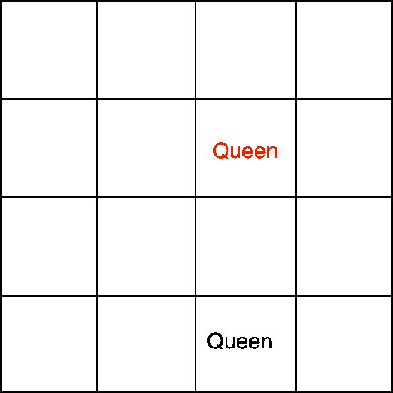

# Attacking Queens

Written in node.js. Run the index.js file with node installed in your command line:

    node index.js

You can update the options in the index.js file. Results are written to the console.

It supports the following cases:

###### Case 1: Function returns true. 2 Queens are attacking on the same column

###### Case 2: Function returns true. 2 queens are attacking on the same row

###### Case 3: Function return true. 2 queens are attacking on the same diagonal

###### Case 4: Function return true. 4 queens, 1 pair attacking

###### Case 5: Function returns false. Not attacking because queens are the same color.

